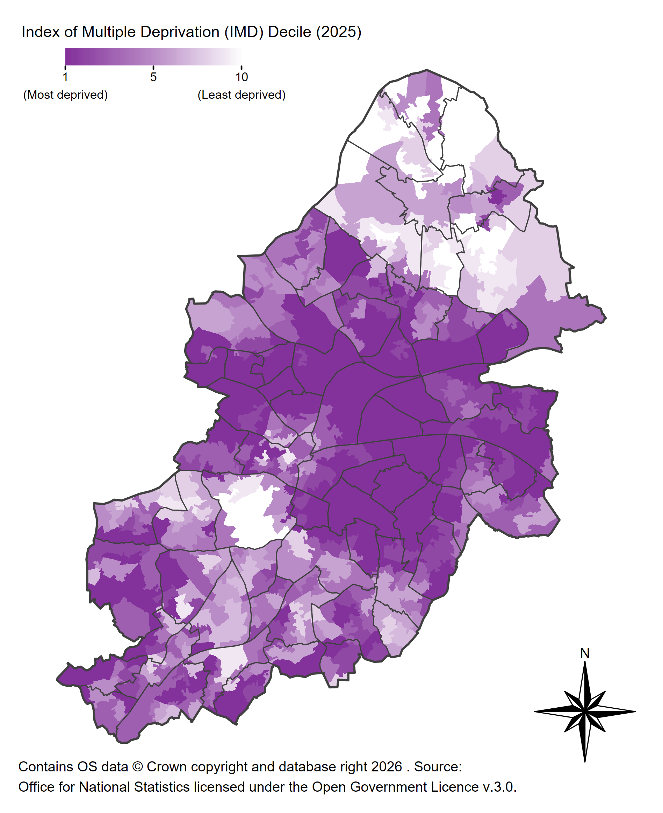

# Birmingham IMD Domain Maps

LSOA-level maps for overall Index of Multiple Deprivation plus each IMD domain:
- Income
- Employment
- Education
- Health
- Crime
- Barriers to Housing & Services
- Living Environment
- Income affecting children
- Income affecting older people

### Example (Overall IMD Decile)

### License

This repository is dual licensed under the [Open Government v3]([https://www.nationalarchives.gov.uk/doc/open-government-licence/version/3/) & MIT. All code can outputs are subject to Crown Copyright.
